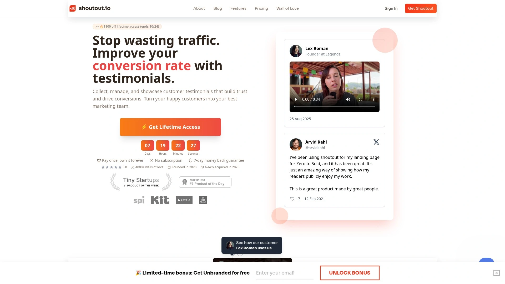

# 2025年排名前18的客户见证收集工具盘点(最新整理)

想让客户开口说好话,但又怕流程太复杂?视频见证看起来高大上,但不知道从哪里下手?如果你正在寻找一款能够快速收集客户反馈、打造信任背书、提升转化率的工具,这份清单会给你答案。从视频录制到文本评价,从自动化编辑到网站嵌入,这些工具覆盖了见证收集的全流程需求。

## **[StoryPrompt](https://www.storyprompt.com)**

让视频见证收集变得像聊天一样自然

StoryPrompt最大的特点是把视频见证流程做到了极致简化。你不需要让客户下载任何应用,只需分享一个链接,客户就能在浏览器里完成录制。更聪明的是,它内置了AI提词器功能,帮助那些不知道该说什么的客户组织语言,让每个人都能录出流畅自然的视频。录完之后系统会自动剪辑,去掉那些"嗯""啊"之类的口头禅和尴尬停顿,还能加上背景音乐和品牌logo。对于不想出镜的客户,还可以选择语音或文字形式提交反馈。所有视频都能一键嵌入网站、邮件或社交媒体,甚至可以创建一个"爱墙"(Wall of Love)展示页面。从收集到展示的整个链路打通,特别适合需要大量视频见证的服务型企业、咨询顾问和课程创作者。

StoryPrompt的定价从免费计划开始,付费版本月费39美元起,提供无限视频响应和高级编辑功能。它的自动化程度高,能够大幅降低你和客户之间的沟通成本,让见证收集这件事从"麻烦的任务"变成"自动运转的系统"。

## **[Senja](https://senja.io)**

多格式见证管理的全能选手

Senja被很多用户评为"综合价值最高"的见证工具,因为它在功能丰富度和易用性之间找到了完美平衡。除了支持视频、文字和音频三种格式的见证收集,Senja还能从26个外部平台自动导入评价,包括Google、G2、Capterra、LinkedIn等主流评论网站。这意味着你不需要手动复制粘贴,所有社交证明都能集中到一个地方管理。它提供数千种展示方式,从网站小部件到弹窗提醒,从静态图片到动态视频墙,几乎能适配任何营销场景。

特别值得一提的是Senja的AI分析功能,它能自动挖掘成百上千条评价中的关键洞察,告诉你客户最喜欢你的哪些方面。这对产品迭代和营销文案优化都很有帮助。定价方面,Senja有慷慨的免费版本,付费计划从每月19美元起,不限制视频和文字响应数量。用户普遍反馈它的界面直观、客服响应快,非常适合中小型企业、SaaS公司和电商卖家。

## **[Famewall](https://famewall.io)**

经济实惠的全功能见证平台

Famewall的创始人本身就是连续创业者,因为受够了市场上其他工具的复杂和昂贵,所以打造了这个"什么都有但价格友好"的解决方案。它的见证收集页面可以高度个性化,你甚至可以嵌入一段自己录制的欢迎视频,让客户感受到诚意,这会显著提高他们提交见证的意愿。客户可以选择录制视频、音频或填写文字评价,全程不超过三次点击。

Famewall支持从25个以上的平台导入现有评价,还能批量上传CSV文件。管理上它允许你创建多个"墙"来分组管理不同产品或不同页面的见证,非常适合管理多个项目或客户的代理机构。展示方式也很灵活,可以生成网站小部件、社交媒体图片、视频合集,甚至可以把见证页面托管在你自己的域名上。价格方面,Famewall有免费计划,付费版本性价比很高,支持团队协作和24/7客服。对于预算有限但需求全面的创业者和小团队来说,这是个很实在的选择。

## **[Testimonial.to](https://testimonial.to)**

简洁高效的无代码方案

Testimonial.to的设计哲学是"让不懂技术的人也能轻松上手"。注册后直接用Google账号登录,系统会用一个YouTube视频带你快速了解功能,整个入门过程不到5分钟。它的收集表单支持视频和文字两种格式,客户可以多次录制直到满意为止。虽然它的项目管理功能相对基础——免费和基础付费版只支持一个"空间"(项目),想要管理多个项目需要额外付费,但对于只有单一产品或服务的企业来说完全够用。

Testimonial.to的亮点在于它的集成能力,可以从Instagram、TikTok、LinkedIn、X(Twitter)、Google、G2、Yelp等平台导入评价,还支持Zapier自动化,比如客户购买后自动发送见证请求。展示方面提供多种小部件样式,用HTML代码嵌入网站,完全不需要开发人员介入。它还有翻译功能支持多语言展示,适合国际化业务。免费计划包含基础功能,付费版从每月约30美元起,视频下载需要消耗积分。适合需要快速启动、不想在技术细节上花太多时间的企业。

## **[VideoAsk](https://www.videoask.com)**

互动式视频对话体验

VideoAsk是Typeform旗下的产品,继承了Typeform那种"让表单变成对话"的设计理念。与其说它是见证收集工具,不如说它创造了一种全新的互动方式。你可以录制一段视频问题,客户看到后用视频回答,形成一种异步视频对话。这种方式特别适合收集深度的、故事化的客户反馈,因为客户会感觉在和真人对话,而不是填写冷冰冰的表单。

VideoAsk支持分支逻辑,根据客户的回答跳转到不同问题,让收集过程更智能。它还有实时通知、移动端友好、1000+应用集成(通过Zapier)等功能。不过需要注意的是,VideoAsk的视频编辑功能相对有限,更适合收集原始素材而不是制作精美成品。定价有免费版本,付费计划从每月24美元起,高流量使用可能费用较高。它特别适合咨询顾问、培训讲师这类需要和客户建立深度连接的职业。

## **[Boast](https://boast.io)**

专注视频见证的专业工具

Boast把所有精力都投入到视频见证这一件事上,目标是帮你收集"最棒的视频见证"。它的流程设计很专业,包括视频编辑工具、自定义展示效果和与主流营销软件的集成。不过Boast只支持视频格式,不能收集文字见证,而且不能添加自定义欢迎视频,这在个性化方面有所欠缺。

管理方面,Boast的仪表板功能强大,可以按姓名、邮箱等搜索,但同样只支持单个项目管理,扩展性受限。展示选项相对简单,只有3种小部件样式,定制化程度不高。最大的争议在于它的定价——没有免费计划,而且每个付费层级都限制每月可收集的视频数量,这对需要大量收集见证的企业来说可能不够友好。但如果你只需要定期收集少量高质量视频见证,并且预算充足,Boast的专业度值得考虑。起步价格相对较高,更适合中大型企业或对视频质量要求极高的品牌。

## **[Feedspace](https://feedspace.io)**

一站式多格式反馈平台

Feedspace是个简单但很实用的见证收集工具,特点是"一个表单搞定所有"。客户可以选择提交音频、视频或文字评价,全都在同一个可定制的表单里完成。Feedspace会为你生成一个展示页面来集中呈现所有评价,这个页面由Feedspace托管,你可以自定义样式让它符合品牌调性。

它支持从30多个平台快速导入现有评价,包括社交媒体和评论网站,还提供手动导入、webhook设置和网站集成功能。对于想要快速搭建社会证明体系的企业来说,Feedspace能帮你把散落各处的好评集中起来,统一展示给访客。它的界面简洁易用,没有过多复杂功能,专注于"收集和展示"这两个核心任务。定价相对透明,适合需要基础功能、不想为高级特性付费的小型企业和个人创业者。

## **[Trust](https://usetrust.io)**

视频见证与信誉管理结合

Trust定位为在线信誉管理软件,但它的核心功能围绕视频见证展开。与纯粹的收集工具不同,Trust更像是一个全方位的评价管理系统,帮你请求评价、监控反馈、突出展示正面评价。它提供单一集中平台来管理所有客户评论,并且有数据分析功能,让你了解客户满意度趋势和需要改进的地方。

Trust的优势在于它不只是收集见证,还能帮你主动管理品牌声誉。你可以设置自动化请求流程,在客户完成服务后的最佳时机发送评价邀请。它还能追踪评价的来源和影响,让你知道哪些渠道的见证转化效果最好。这对重视线上口碑的服务型企业、本地商家和多地点连锁品牌特别有价值。定价会根据企业规模和需求定制,通常比简单的见证收集工具要贵一些,但提供的价值也更全面。

## **[Testimonial Hero](https://testimonialhero.com)**

端到端专业视频制作服务

Testimonial Hero和榜单上其他工具有个根本区别——它不是自助软件,而是提供全套专业服务的团队。从策划、拍摄到后期剪辑,他们有专业团队帮你搞定一切。这意味着你得到的不是客户用手机随手拍的视频,而是精心制作的、具备专业品质的见证内容,可以直接用在重要的营销活动、销售演示或网站首页。

这种模式的好处是省心且效果有保证,特别适合大型B2B企业、高客单价产品或对品牌形象要求极高的公司。坏处是成本高、周期长,不适合需要快速大量收集见证的场景。如果你的目标客户价值很高,投资几千到上万美元制作一组顶级视频见证是合理的,Testimonial Hero能帮你实现。但如果你需要的是持续的、低成本的见证收集流程,自助型软件会更合适。

## **[VideoPeel](https://videopeel.com)**

用户生成内容管理平台

VideoPeel把自己定位为"客户视频平台",不仅收集见证,还鼓励客户创造各种用户生成内容(UGC)。它的功能包括视频收集、管理、发布和分析,形成完整的内容循环。企业可以通过VideoPeel发起视频征集活动,客户用手机提交视频,平台帮你筛选、整理和发布。

VideoPeel强调的是激活客户的创造力,把他们变成品牌的内容贡献者。这种模式特别适合消费品牌、时尚美妆、食品饮料等需要大量真实使用场景的行业。平台提供丰富的管理工具,可以给视频打标签、分类、评分,方便后续在不同营销渠道使用。它还有社交媒体优化功能,确保视频在各个平台上都能获得最佳展示效果。定价通常按企业规模定制,功能丰富但学习曲线稍陡,更适合有专门营销团队的中大型企业。

## **[Bonjoro](https://www.bonjoro.com)**

个性化视频互动工具

Bonjoro的核心思路是"用视频建立人情味"。虽然它主要用于给客户发送个性化视频消息(比如欢迎新用户、感谢购买、提供支持),但也可以用来收集视频见证。它的工作方式是你先用视频向客户提问,客户看到后用视频回复,形成一种温暖的双向交流。

Bonjoro特别适合注重客户关系的企业,比如在线教育、会员制社区、高端服务。通过视频而不是文字和客户沟通,能大幅提升客户忠诚度和情感连接。它的移动应用很强大,你可以随时随地录制和查看视频,非常灵活。不过作为见证收集工具来说,Bonjoro的功能相对专注于一对一互动,不太适合批量收集和展示。定价从免费版开始,付费计划提供更多自动化和集成功能,适合创始人或销售团队亲自参与客户互动的小型企业。

## **[Soapbox by Wistia](https://www.wistia.com/soapbox)**

浏览器内录制与分享

Soapbox是视频营销平台Wistia推出的免费工具,让你直接在浏览器里录制、编辑和分享视频。它的特色是画中画模式,可以同时展示你的脸和屏幕内容,非常适合产品演示、使用教程和客户案例分享。虽然Soapbox不是专门的见证收集工具,但你可以用它快速录制客户访谈或引导客户自己录制见证视频。

录制完成后,视频会自动上传到Wistia托管,你可以得到一个分享链接,也可以下载文件用在其他地方。Soapbox的编辑功能简单但够用,可以裁剪片段、调整布局、添加品牌元素。它完全免费且不限时长,对于想要偶尔录制几段见证视频但不需要复杂系统的用户来说,这是个轻量级的好选择。缺点是缺乏自动化收集、批量管理和展示小部件等专业见证工具的功能,更适合作为辅助手段而不是主要解决方案。

## **[Tolstoy](https://www.gotolstoy.com)**

互动视频营销引擎

Tolstoy的核心是"让视频变得可互动"。它允许你创建分支视频路径,观众可以根据自己的兴趣点击不同选项,看到不同内容。这种技术应用到见证收集上,就是可以引导客户回答一系列问题,最终形成结构化的视频见证。Tolstoy还支持在视频中嵌入行动号召按钮,比如"立即购买""预约咨询"等,让见证不只是展示,还能直接驱动转化。

它的定制化程度很高,可以完全融入你的网站设计,客户甚至感觉不到这是一个外部工具。Tolstoy特别适合电商、SaaS和在线教育,这些行业需要在购买路径上不断强化信任。不过它的定位更偏向营销自动化,见证收集只是功能之一,如果你只需要简单收集和展示见证,Tolstoy可能太重了。定价根据视频播放量和功能模块而定,适合已经有成熟营销体系、希望把视频互动提升到新水平的企业。

## **[Vocal Video](https://vocalvideo.com)**

问题驱动的视频收集

Vocal Video的方法是通过一系列精心设计的问题来引导客户录制见证。你创建一个"视频请求",里面包含你希望客户回答的问题,客户看到后按照提示逐个录制回答。这种结构化方式确保你得到的见证内容完整且有重点,而不是客户随意发挥不知道说什么。

Vocal Video内置了视频编辑器,可以裁剪片段、调整顺序、添加字幕和品牌元素。编辑完成后,视频可以一键分享到社交媒体,或者嵌入网站和邮件。它还提供团队协作功能,多个成员可以共同管理见证库,适合代理机构或大型营销团队。定价按计划分层,从个人创业者到企业都有对应选项。Vocal Video的优势在于它的引导性很强,能帮助那些不熟悉视频见证流程的企业快速上手,收集到质量稳定的内容。

## **[Vouch](https://vouchfor.com)**

视频信任管理平台

Vouch专注于通过视频建立信任,它不仅帮你收集见证,还提供了一套完整的视频信任体系。你可以用Vouch创建视频简历、客户案例、产品推荐等多种类型的信任内容。它的收集流程很人性化,客户可以在手机、平板或电脑上录制,系统会自动处理和存储。

Vouch的组织功能很强,你可以按项目、客户类型或用途对视频进行分类,快速找到需要的内容。它还支持创建视频集合,把多个相关见证组合成一个展示页面,讲述完整的故事。这对B2B销售特别有用,你可以针对不同行业或痛点准备不同的见证集合。Vouch的定价灵活,有免费试用,付费版提供更多存储空间和高级功能。它适合重视客户关系、需要长期积累和管理信任资产的企业。

## **[Vidmonials](https://vidmonials.com)**

简洁的视频见证专用工具

Vidmonials的界面友好且功能聚焦,就做一件事:收集和展示视频见证。你可以创建收集请求,发送给客户,客户点击链接后直接在浏览器录制视频,不需要注册或下载任何东西。录制完成后,视频自动出现在你的仪表板里,你可以审核、批准和嵌入到网站。

Vidmonials的优势是简单和快速,从创建请求到收到第一个见证可能只需要几分钟。它没有复杂的设置选项,这对不熟悉技术的用户来说是好事,但对需要深度定制的用户可能不够灵活。展示方面提供基础的嵌入代码和分享选项,能满足大部分常规需求。定价透明且合理,适合小型企业、自由职业者和刚开始建立社会证明的创业项目。如果你需要的是"马上能用、不用学"的工具,Vidmonials值得试试。

## **[Trustmary](https://trustmary.com)**

自动化评价收集系统

Trustmary的强项是自动化。它可以在客户旅程的关键节点自动发送评价请求,比如完成购买后、使用产品一周后或完成服务后。这样你不需要手动记住要向谁要见证,系统会自动运转。它收集的评价类型包括视频、文字、评分等,并且会自动分析客户情绪,识别哪些是强烈推荐,哪些可能有顾虑。

Trustmary还有强大的发布功能,可以自动把最新的好评展示在网站上,保持内容的新鲜度。它的分析仪表板会告诉你见证的转化效果,比如有多少访客看了见证后进行了购买。这些数据对优化营销策略很有价值。Trustmary的定价按功能模块和使用量计费,适合有持续获客需求、希望把见证收集变成自动化流程的成长型企业。它特别适合电商、SaaS和服务型企业,这些行业有明确的客户生命周期阶段可以触发评价请求。

## **[Shoutout](https://shoutout.so)**

创作者友好的极简工具

Shoutout是专为创作者和小型企业设计的见证平台,界面极简且上手快。你可以创建收集表单,支持文字和视频两种格式,客户填写提交后,见证会出现在你的仪表板。Shoutout的特点是"少即是多",没有花哨功能,但把核心体验做得很流畅。

它的展示选项包括网站小部件和Wall of Love链接,可以把见证集中在一个漂亮的页面上分享给潜在客户。不过需要注意的是,Shoutout缺少一些高级功能,比如从第三方平台批量导入、创建见证图片、单独分享见证链接等。它的管理功能也比较基础,不支持跨项目移动见证或复杂的分类系统。定价方面有免费计划可以开始使用,付费版价格相对便宜,适合预算有限、需求简单的个人创业者、教练和小型服务商。

## **[Endorsal](https://endorsal.io)**

企业级评价管理方案

Endorsal面向的是有复杂需求的企业和大型组织。它提供的功能包括自定义收集表单(Endoforms)、多种展示小部件、徽章和产品评分系统。与很多工具不同,Endorsal支持通过短信请求评价,这在某些行业(比如本地服务)转化率会更高。它还有FOMO弹窗功能,可以在网站上实时显示"某某刚刚留下了5星评价",营造社会证明氛围。

Endorsal有丰富的集成选项,可以连接CRM、营销自动化平台和其他业务系统。不过它的定价模式是按量计费的,每个套餐都限制了可收集的视频见证数量和月度浏览量,随着业务增长费用会快速上升。另外,基础套餐不支持多项目管理,如果你有多条产品线或多个品牌,需要为每个单独付费。Endorsal适合有专门营销预算、需要企业级功能和技术支持的中大型公司,对于小型企业来说可能显得过于复杂和昂贵。

## 常见问题

**如何选择适合自己的见证收集工具?**

先明确你的核心需求:如果主要收集视频见证且预算充足,StoryPrompt和Boast是专业选择;如果需要管理多种格式(视频、文字、音频)并且希望功能全面,Senja和Famewall性价比更高;如果只是小规模使用、想要快速上手,Testimonial.to和Shoutout的简洁界面会更友好。另外考虑集成需求,如果你已经在用其他营销工具,选择支持Zapier或有API的平台能省很多麻烦。

**客户通常更愿意提供哪种形式的见证?**

实际情况是大部分客户更倾向于文字见证,因为不需要出镜、可以反复修改、心理压力小。视频见证虽然转化效果更好,但收集难度也更大。最好的策略是提供多种选择——让客户自己决定用视频、语音还是文字,这样能提高整体响应率。像StoryPrompt、Senja和Famewall这些工具都支持多格式收集,给客户灵活性的同时也确保你能收到足够多的反馈。

**见证工具的费用通常是多少?**

市面上大部分工具都有免费版本,足够小规模使用和测试。付费计划通常从每月15到50美元不等,差异主要在视频数量限制、存储空间、高级功能和品牌定制选项上。需要注意的是,有些工具采用按量计费(比如每月可收集的视频数),如果你的需求波动大,选择不限量的套餐会更划算。企业级方案一般需要定制报价,价格可能到每月数百美元,但会提供专属支持和高级安全功能。

## 总结

见证收集工具的核心价值在于把"求人办事"这件尴尬的事情变得系统化、自动化。从这份清单来看,[StoryPrompt](https://www.storyprompt.com)在视频见证场景下的用户体验最流畅,AI辅助录制和自动编辑功能大幅降低了客户的参与门槛,特别适合需要大量高质量视频素材的服务型企业和个人品牌。配合它的Wall of Love展示功能,从收集到转化形成完整闭环。无论你选择哪个工具,关键是要开始行动——客户的真实声音永远比自己说一万句广告词更有说服力。
